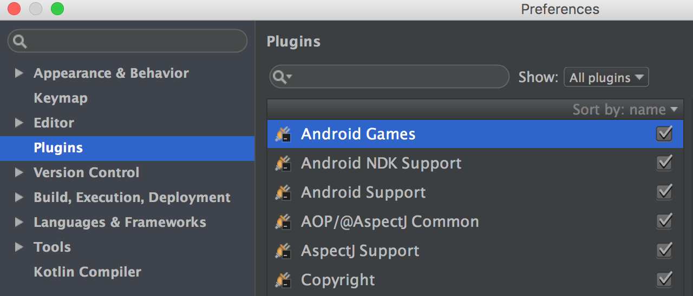
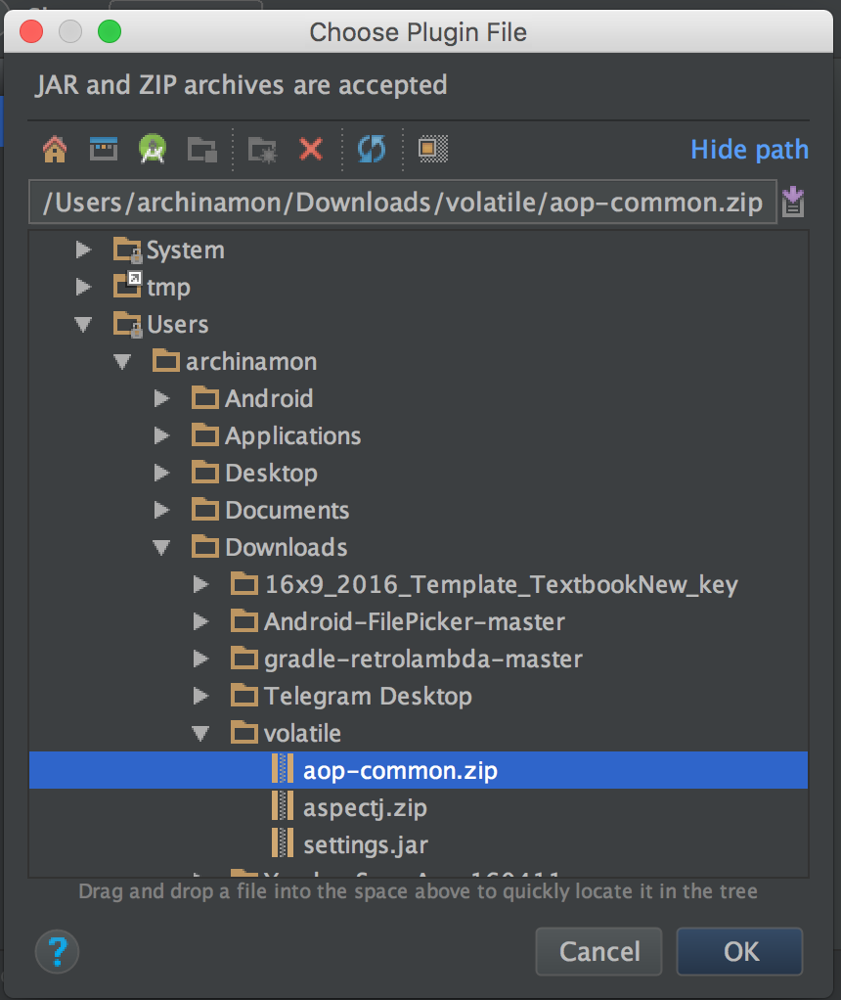
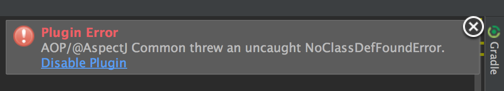

# How to handle `aspectj` syntax in Android Studio

* First go to Settings/Plugins
 

* Click on `Install plugin from disk...` button and sequentialy install both file: <a href="aop-common.zip">aop-common.zip</a> and <a href="aspectj.zip">aspectj.zip</a>.
 

* Restart Android Studio
* Have a pleasure writing aspects!
* But... You may see this "error" while writing/editing aspect files.
 
 Just ignore it.  This IDE plugin not fully works in AS.
